# EC2 UDP Server Configuration

## 1. Open EC2

In the AWS Console, open **EC2** and select **Launch instance**.

## 2. Start a New Instance

From the EC2 dashboard, click **Launch instance**.

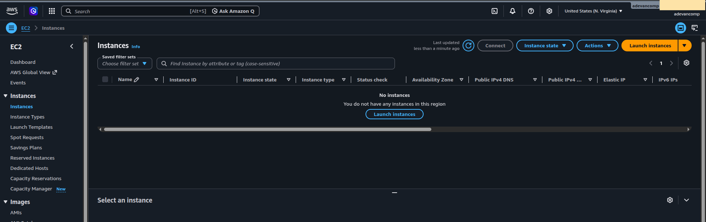

## 3. Name and AMI

Fill in:

- **Name**: `ntn-udp-server`
- **Application and OS Images (Amazon Machine Image)**: Ubuntu Server

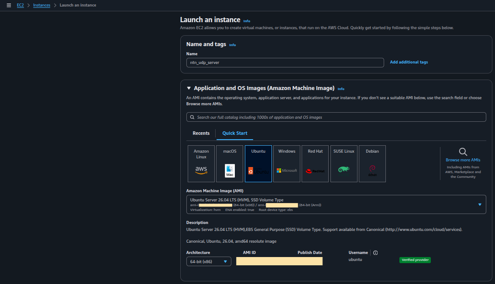

## 4. Create a Key Pair

In **Key pair (login)**, choose **Create new key pair**.

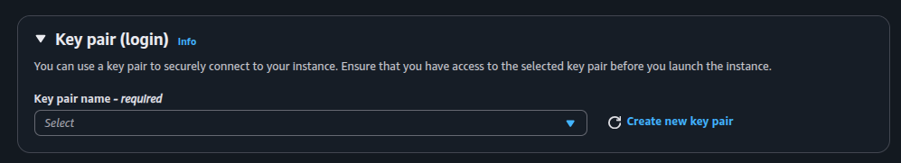

Configure:

- **Key pair name**: `nb-iot-ntn-poc-key`
- **Key pair type**: `RSA`
- **Private key file format**: `.pem`

Then click **Create key pair**.

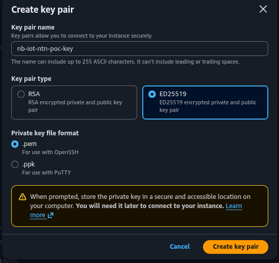

## 5. Select the Key Pair

Confirm the new key pair is selected in **Key pair name**.

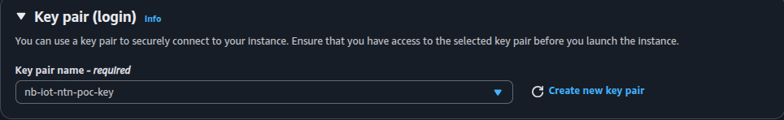

## 6. Network Settings

In **Network settings**, keep the default VPC and enable a public IP.

Create a new security group:

- **Security group name**: `nb-iot-ntn-udp-sg`
- **Description**: `Group NTN`

Add inbound rules:

- **SSH**, TCP, port `22`, source `My IP`
- **Custom UDP**, UDP, port `9000`, source `0.0.0.0/0`

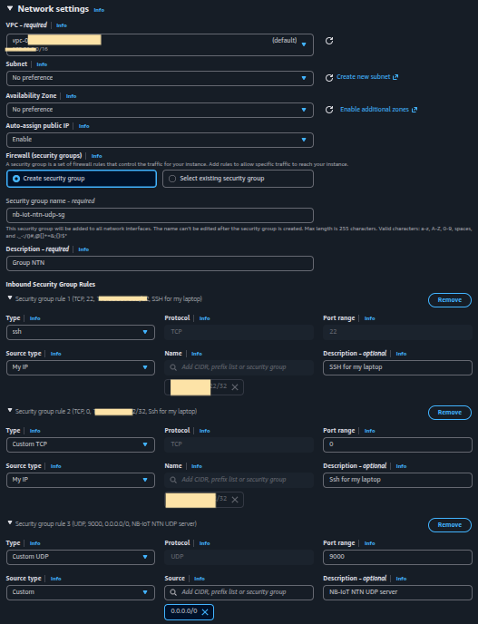

## 7. Launch

Review the configuration and click **Launch instance**.

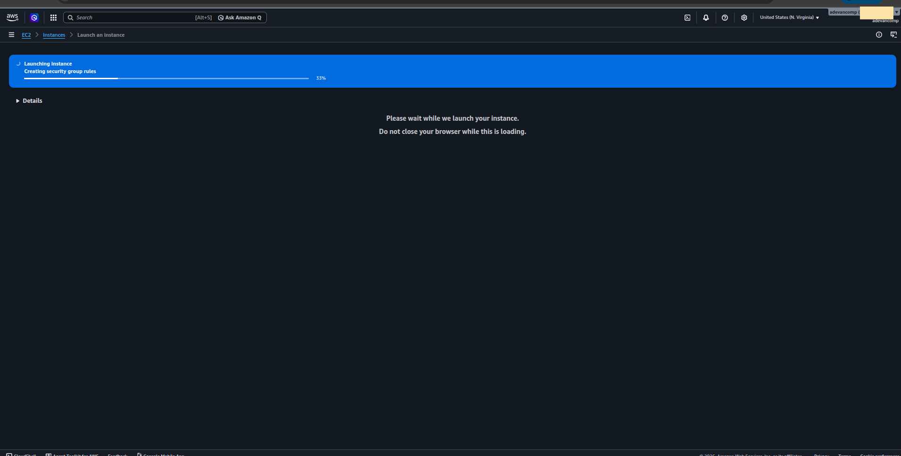

Wait for the launch to finish.

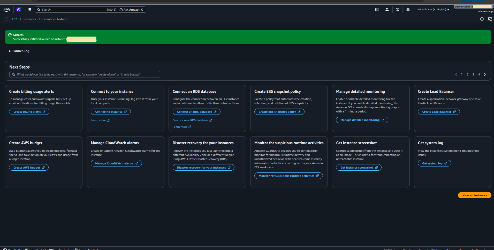

## 8. Confirm the Instance

Go to **Instances** and wait until the instance state is **Running**.

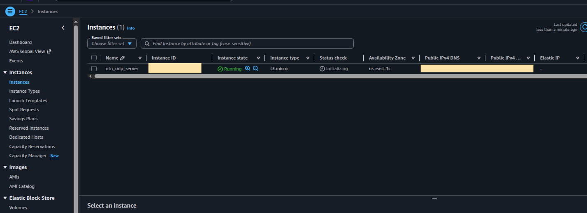

Open the instance details and copy the **Public IPv4 address**.

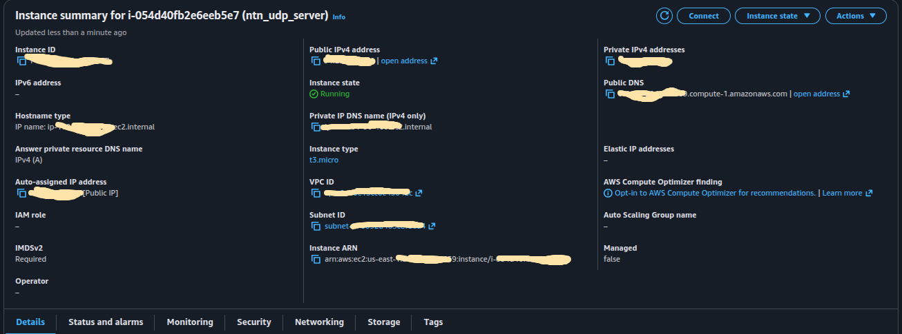

## 9. Connect with SSH

Use the EC2 **Connect to instance** page and copy the SSH command.

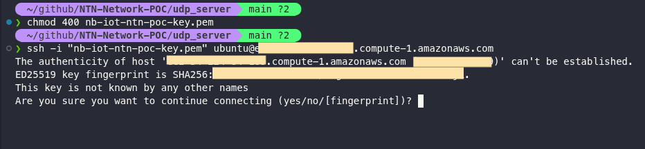

Run the command locally using the downloaded `.pem` file:

```bash
ssh -i "nb-iot-ntn-poc-key.pem" ubuntu@<public-ipv4-address>
```

Successful connection:

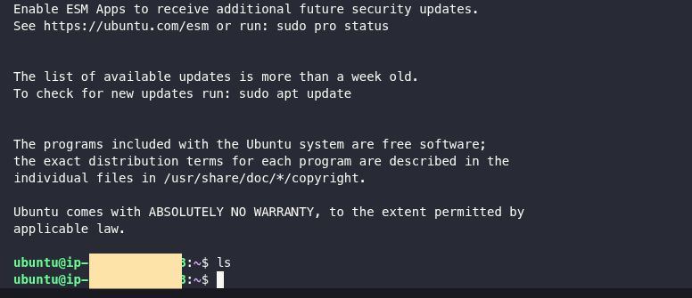
